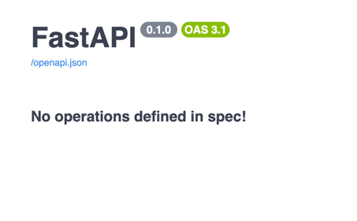
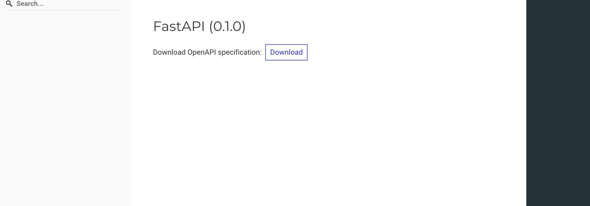

In this quickstart guide, you'll learn how to **install** the Ocean CLI, **scaffold** a new integration, add your **custom logic** and **run** the new integration locally.

## Requirements

Python 3.11

## Installation

<div class="termy">

```console

$ pip install "port-ocena[cli]"
---> 100%
```

</div>
## Example

### Scaffold

<div class="termy" style="max-height: 500px">

```console
$ ocean new

🚢 Unloading cargo... Setting up your integration at the dock.
integration_name [Name of the integration]:
$ myIntegration

integration_slug [myintegration]:
$ my_slug

integration_short_description [A short description of the project]:
$ My custom integration made for Port

full_name [Your name]:
$ Monkey D. Luffy

email [Your address email <you@example.com>]:
$ straw@hat.com

release_date [2023-08-06]:
$ 2023-08-06


🌊 Ahoy, Captain! Your project is ready to set sail into the vast ocean of possibilities!
Here are your next steps:

⚓️ Install necessary packages: Run make install to install all required packages for your project.
▶️ cd ./my_slug && make install && . .venv/bin/activate

⚓️ Set sail with Ocean: Run ocean sail <path_to_integration> to run the project using Ocean.
▶️ ocean sail ./my_slug

⚓️ Smooth sailing with Make: Alternatively, you can run make run to launch your project using Make.
▶️ make run ./my_slug
```

</div>

### Develop

- Edit the file `./my_slug/main.py` to add your integration logic.

```python linenums="1"
from typing import Any

from port_ocean.context.ocean import ocean


@ocean.on_resync('project')
async def resync_project(kind: str) -> list[dict[Any, Any]]:
    # 1. Get all projects from the source system
    # 2. Return a list of dictionaries with the raw data of the state
    return [{"some_project_key": "someProjectValue", ...}]


# Optional
# Listen to the start event of the integration. Called once when the integration starts.
@ocean.on_start()
async def on_start() -> None:
    print("Starting integration")

```

- Edit the file `./my_slug/.port/spec.yaml` to add your integration specification.

```yaml linenums="1"
version: v0.1.0
# The integration name
type: my-jira-integration
description: myIntegration integration for Port Ocean
# The integration icon taken from the icon list in Port
icon: Cookiecutter
features:
  - type: exporter
    # Where in the ingest modal should this integration be shown
    section: Ticket management
    resources:
      # The kinds that this integration can export (if known)
      - kind: <ResourceName1>
      - kind: <ResourceName2>
configurations:
  - name: myJiraToken
    required: true
    type: string
    sensitive: true
  - name: jiraUrl
    type: url
```

- Edit the file `./my_slug/config.yaml` to add the default configuration of your integration.

```yaml linenums="1" hl_lines="5-6 13-18"
# This is an example configuration file for the integration service.
# Please copy this file to config.yaml file in the integration folder and edit it to your needs.

port:
  clientId: { { from env PORT_CLIENT_ID } } # Can be loaded via environment variable: PORT_CLIENT_ID or OCEAN__PORT__CLIENT_ID
  clientSecret: { { from env PORT_CLIENT_SECRET } } # Can be loaded via environment variable: PORT_CLIENT_SECRET or OCEAN__PORT__CLIENT_SECRET
# The event listener to use for the integration service.
eventListener:
  type: POLLING
integration:
  # The identifier of this integration instance.
  # Can be loaded via environment variable: INTEGRATION_IDENTIFIER or OCEAN__INTEGRATION__IDENTIFIER
  identifier: { { from env INTEGRATION_IDENTIFIER } }

  # These two should match the values in the .port/spec.yaml file
  type: "My Integration type (Gitlab, Jira, etc.)"
  config:
    myJiraToken: { { from env MY_INTEGRATION_CONFIG } }
    jiraUrl: "https://example.com"
```

### Run

<div class="termy">

```console
$ cd ./my_integration
$ make install
---> 100%

$ . .venv/bin/activate
$ (my_slug3.11) ocean sail
Setting sail... ⛵️⚓️⛵️⚓️ All hands on deck! ⚓
INFO:     Started server process [50121]
INFO:     Waiting for application startup.
INFO:     Uvicorn running on http://0.0.0.0:8000 (Press CTRL+C to quit)
```

</div>

#### Interactive API docs

An integration comes built-in with a FastAPI server which also provides a REST interface and a Swagger webpage.

To view the routes exposed by your integration open your browser and go to [http://localhost:8000/docs](http://localhost:8000/docs). You will see the automatic interactive API documentation for the integration routes (provided by [Swagger UI](https://github.com/swagger-api/swagger-ui)):



<details markdown="1">
<summary>Alternative API docs</summary>

There is an alternative to the API docs (provided by [Redoc](https://github.com/Redocly/redoc))

Open your browser and go to [http://localhost:8000/redoc](http://localhost:8000/redoc). You will see the following:



</details>
